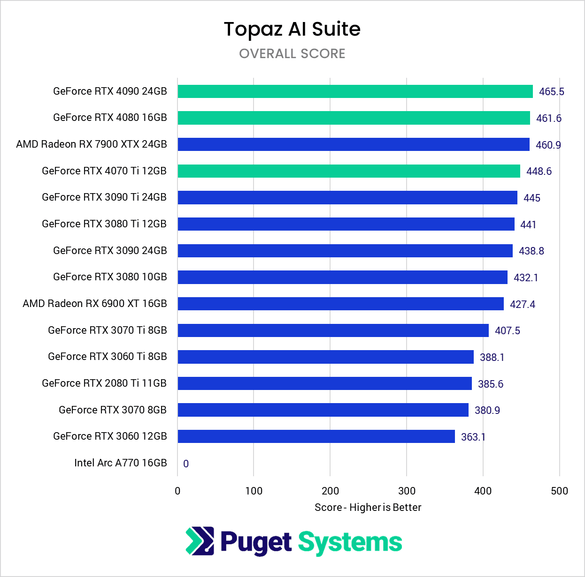
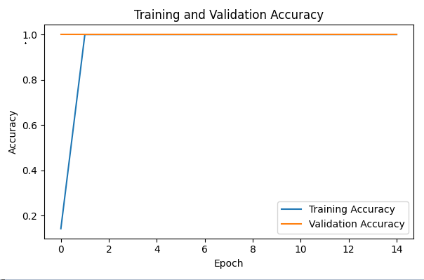
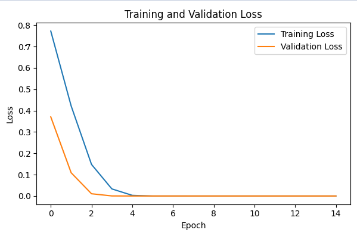

# Face Blur

## Overview

This is a small project using a neural network to locate and then blur your face.
<br>
### Navigation
**[Requirements](#requirements)**
<br>
[GPU requirements](#gpu)
<br>
[Dataset size](#dataset)
<br>
[Epochs amount](#epochs)

## Requirements

## Setup
### Downloading
Click [here](https://github.com/CassidyMabey/face-blur-tracking/archive/refs/heads/main.zip) to download. 
Once downloaded, you can extract it using windows or an external tool.
<br><br>
or use this git command
```
git clone https://github.com/CassidyMabey/face-blur-tracking.git
```

### Training your own model
Once you have [downloaded](#downloading) the repository, go into the `training.py` file. This is where all of the training will occur.
<br>
If you havent already, you need to install the [dependencies](#dependencies).
<br>
Next make sure you have set up your directory like this:
```
face-blur-tracking/
│
├── tracking.py                     
├── training.py          
│
├── samples/                        # Fill this with all of your images of faces         
│   ├── img1.jpg
│   ├── img2.jpg
│   ├── ...
│
└── output/                          
    ├── faces/                      # This folder is very important and the program will NOT run without it.
    │   ├── ...                     # This will be filled by the program you dont need to fill it yourself
    │
    ├── training_history.png        # This will be generated by the program
    ├── face_tracking_model.keras   # This will be generated by the program
    ├── face_tracking_model.h5      # This will be generated by the program
    ├── face_tracking_model.tflite  # This will be generated by the program
```
<br>

You only need to create the `./output`, `./output/faces` and fill `./samples` with your images.
<br>

Finally, you can run the `training.py` using the command below

```
python training.py
```

<br>

You will know the program is finished when you get 2 graphs in your screen, the `Training and Validation Loss` and `Training and Validation Accuracy`. These will help you know a few things such as if you have too many or too little samples and if you have too many / little epochs. You can view what to do and when [here](#improvements).

<br>

Make sure to close out of it (dont worry it saves to `output/training_history.png`) which will allow the program to continue where you should then see something like this: `TFLite model saved to .\output\face_tracking_model.tflite` then `Training done`. 

<br>

Well Done! you have now successfully trained a neural network.

### Using Your Own Models
To use your own model, it is alot simpler. If you don't have a model you can [train your own model](#training-your-own-model) or you can a pretrained one from `./pretrained_models`.
<br>
If you have trained your own model, go into the `tracking.py` and find the variable called `MODEL_PATH` and then set it to the location of your model which will be  `MODEL_PATH = "./output/face_tracking_model"` if you havent moved it.
<br><br>
Otherwise go into the `tracking.py` and find the variable called `MODEL_PATH` and then set it to the location of your model e.g `MODEL_PATH = "./pretrained_models/2000images_5epochs"`.

<br>
After that, a window should open which will display out of your camera with the:

FPS - the amount of frames your model is processing a second
Faces - the amount of faces the model sees

### Dependencies

To get started, you'll need to install the required libraries. You can install them using `pip`:

```bash
pip install -r requirements.txt
```

## Reccomended
### GPU
Any NVIDIA GPU will do better than most AMD or Intel GPU. NVIDIA has Compute Unified Device Architecture or CUDA which allows it to have better performance with neural networks. This will increase the speed of which your neural network will run and the better it will blur your face.
<div>
  
  
</div>
This shows the training performance of lots of consumer cards of NVIDIA, AMD and Intel. Bear in mind the higher score, the better it will perform in training which includes epochs, processing and most other things.

## Improvements
### Dataset
The dataset is the amount of images which you are putting into it.
**Increase Dataset Size When:**

1. Your model achieves high accuracy very quickly like the image below

This basically means that your model is too smart for the amount of data your giving it (giving a spelling book to someone in college etc).

2. Theres a large gap between training and validation accuracy. This is refered to as overfitting


3. Your model when being used doesnt detect faces very well. you will see this yourself

### Epochs
**Increase Epochs When:**

1. You’re training on a larger dataset. (>1000 images  start to consider it)
  
2. Loss is decreasing slowly (could also be a sign of a small data set)


